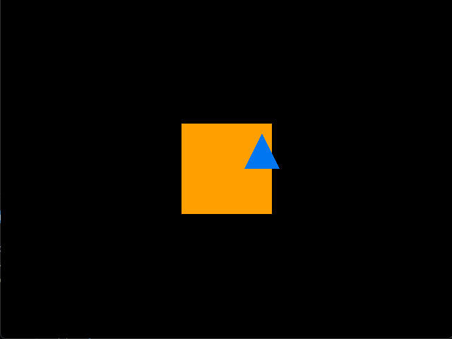
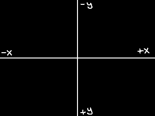

# Macroquad Freedom Camera2D

This is a free-moving camera for the [rust](https://www.rust-lang.org/) lightweight game library [Macroquad](https://macroquad.rs/).

**Mouse Wheel Up/Down:** Zoom in/out  
**Left Click Hold and Move:** Move camera  

Only two variable in initialization ``camera, zoomer`` and one function in game loop ``camera_fixer(&mut camera, &mut zoomer)`` with ~30 lines of code is all it needs to work.

**World center is on the center of the window by default unlike world center on top left corner.**

